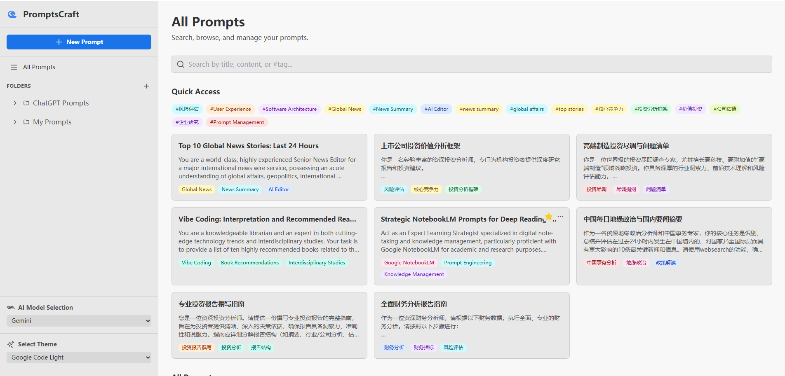

# 🤖 PromptsCraft: AI-Powered Prompt Engineering

Effortlessly craft professional prompts for any AI model from a single sentence. PromptsCraft is your AI-powered assistant for prompt engineering, built entirely by AI.

## ✨ Key Features

-   **🚀 Instant Prompt Generation:** Turn a simple idea into a detailed, professional prompt.
-   **🔄 Multi-model Support:** Select the target AI model (Gemini, Deepseek, etc.) for optimized prompt structure.
-   **🗂️ Prompt Management:** Organize your prompts with folders, tags, and favorites.
-   **🏷️ AI-Generated Tags:** Automatically get tag suggestions for your prompts.
-   **✍️ Prompt Refinement:** Enhance your prompts with additional context, persona, and formatting options.
-   **💡 AI-Suggested Titles:** Generate catchy and descriptive titles for your prompts.

## 📸 Screenshot


*The main interface of PromptsCraft, showing the folder-based organization, quick access tags, and a grid of prompt cards.*

## 🧠 "Vibe Coding": The Story Behind PromptsCraft

This project is a testament to a new paradigm of software development: **Vibe Coding**. The entire application, from the frontend UI to the backend server, was generated by Google's AI tools. The developer's role was to guide the AI with high-level concepts and "vibes", without writing a single line of code.

The development process involved:

-   **Gemini CLI:** For interactive code generation, modification, and debugging.
-   **Google AI Studio:** For prompt design and experimentation.
-   **Stitch:** Leveraged for rapid UI/UX prototyping and visual design.
-   **NotebookLM:** Generating ideas and synthesizing information from various sources including books and other materials.

PromptsCraft is a living example of how AI can not only be a tool for creativity but also the creator of the tools themselves.

## 🛠️ Technologies Used

-   **Frontend:** React, TypeScript, Tailwind CSS, Vite
-   **Backend:** Node.js, Express, SQLite
-   **AI Development Tools:** Gemini CLI, Google AI Studio, Stitch, NotebookLM

## 🚀 Getting Started

### Prerequisites

-   Node.js
-   pnpm

### Installation

```bash
# Install dependencies from the root directory
pnpm install
```

### Running the Application

```bash
# Run the development server from the root directory
pnpm dev
```

The application will be available at `http://localhost:5173` (or another port if 5173 is in use).

## 🙌 Contributing

Contributions are welcome! Please feel free to open an issue or submit a pull request.

1.  Fork the repository.
2.  Create a new branch (`git checkout -b feature/your-feature`).
3.  Make your changes.
4.  Commit your changes (`git commit -m 'Add some feature'`).
5.  Push to the branch (`git push origin feature/your-feature`).
6.  Open a pull request.